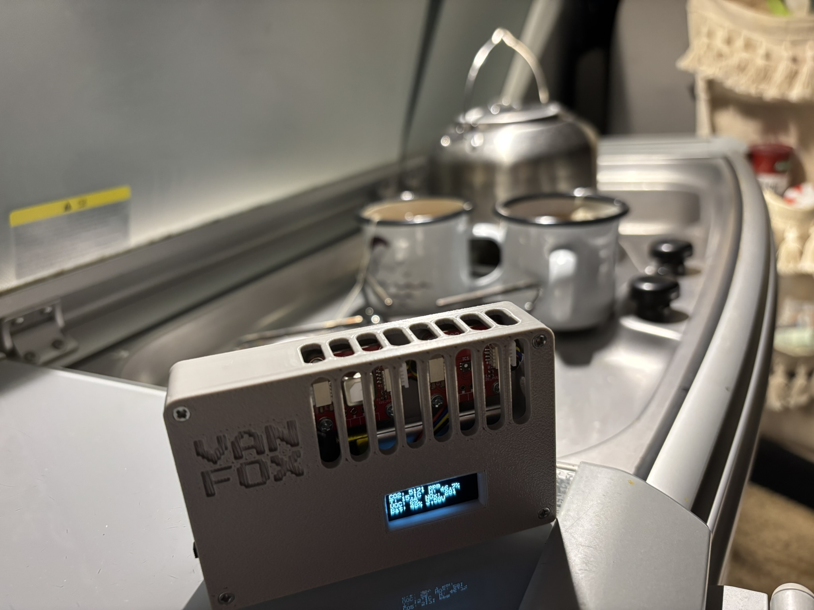

# VanFox 🦊  – Portable Air Quality Monitor for Camper Vans



**VanFox** is a fully self-contained ESP32-C3-based air quality monitor designed for camper vans and Home Assistant together.
It combines multiple environmental sensors, a motion-activated OLED display and gesture-based control. The secondary goal was to make parts available in one place.
The battery gives it the ability to operate without power, in case of a power outage or to take it outside with you.

## Assembly Guide

1. Purchase the components
	- ~298czk [Board](https://www.laskakit.cz/laskakit-microesp/)
	- ~768czk [CO2, temerature and humidity senzor](https://www.laskakit.cz/laskakit-scd41-senzor-co2--teploty-a-vlhkosti-vzduchu)
	- ~368czk [VOx and NOx senzor](https://www.laskakit.cz/laskakit-sgp41-voc-a-nox-senzor-kvality-ovzdusi/)
	- ~118czk [Battery](https://www.laskakit.cz/ehao-lipol-baterie-603048-900mah-3-7v/)
	- ~128czk [Oled Display](https://www.laskakit.cz/laskakit-oled-displej-128x32-0-91--i--c/)
	- ~198czk [Gyroscop](https://www.laskakit.cz/laskakit-bmi270-6-osy-gyroskop-a-akcelerometr/)
	- ~6czk [Buzz](https://www.laskakit.cz/aktivni-bzucak-3-3v/)
	- ~4czk [Switch](https://www.laskakit.cz/posuvny-prepinac-0-5a-50vdc/)
	- 4x~12czk [uŠup](https://www.laskakit.cz/--sup--stemma-qt--qwiic-jst-sh-4-pin-kabel-5cm/)

2. 3D print the enclosure from [3D](3D).
3. Solder the buzzer, switch, I²C cables, and battery to the ESP board. For I²C and battery, the pin placement is fixed by the board design. GPIO pins for the buzzer and switch were intentionally placed as far as possible from the USB-C connector, so the board fits properly into the enclosure.
4. Create a copy of `secrets_example.h` and rename it to `secrets.h`, then fill in all required values. 
5. Use Arduino IDE to flash the firmware to the device.
6. Home Assistant integration (optional)
	- Install the MQTT Broker add-on.
	- In the add-on configuration, add the device credentials `MQTT_NAME` and `MQTT_PASSWORD`.

There is also an option to use [ESPhome](SW/vanfox-esphome.yaml). However, gyroscope support is currently missing, which means, the display cannot be turned off automatically and will remain on continuously.


## Operating Modes

### Air Quality Mode (default)
Displays current environmental readings:
```
CO2: 412 ppm
T: 21.3°C  H: 45.7%
VOC: 102  NOx: 34
Bat: 100% (4.05V)
```
- OLED automatically turns off after 10 s of no motion.
- Device enters **light sleep** between sensor reads for power saving. (this feature is in experimental phase)

### Level Mode (Digital Spirit Level)
Activated by **triple shake gesture**:
- Shows inclination (roll) in degrees.
- Automatically returns to **Air Mode** after 2 minutes.
- Uses continuous polling (no sleep) — ideal for calibration or debugging.
- USB remains active → can be flashed without reset.

### Switch
For now it serves for switching between "Traveling mode" and "Home mode". 

## TODO
- use switch for deepsleep mode insetead of switching between traveling and home mode,
- add boudaries for buzz,